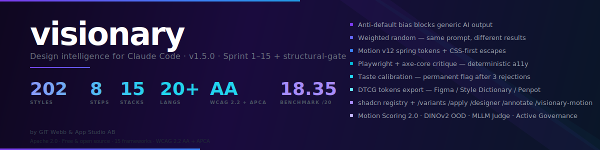

<div align="center">


</div>

<br/>

# visionary-claude

[](https://github.com/GIT-Webb-App-Studio-AB/Visionary-for-Claude-Code/releases)
[](https://github.com/GIT-Webb-App-Studio-AB/Visionary-for-Claude-Code/releases/tag/v1.5.1)
[](#design-catalogue)
[](#frameworks-supported)
[](#language-support)
[-yellow?style=flat-square)](results/)
[](LICENSE)

[](https://github.com/GIT-Webb-App-Studio-AB/Visionary-for-Claude-Code)
[](#requirements)
[](#accessibility)
[](tokens/)
[](https://www.paypal.com/donate/?business=BMNFKYM6BU3KG&no_recurring=0&item_name=Utveckling+av+mjukvara+och+Claude+Code+ekosystem&currency_code=USD)
[](https://github.com/sponsors/gitwebb)

A Claude Code plugin that provides **design intelligence** for building distinctive, motion-first UI across 15 frameworks. Generates, critiques (axe-core-instrumented), and learns from your preferences over time.

> **Current benchmark transparency**: the published 18.35/20 number
> reflects a partial run (10 of 100 prompts, one sample per prompt) —
> see [`results/README.md`](results/README.md) for the honest breakdown.
> A full 100/100 run is the next release target; the infrastructure
> (adapters, headless runner) landed in v1.3.1 under
> [`benchmark/adapters/`](benchmark/adapters/). Motion Readiness was the
> weakest dimension (3.55/5) in that partial run and is explicitly
> addressed in the v1.3.1 Output Contract motion floor.

---

<div align="center">

### Design Intelligence for Claude Code

**202 design styles**, an **8-step selection algorithm**, **motion-first code** (Motion v12 + CSS-first), a **visual feedback loop** (Playwright + axe-core) that learns from your preferences, **DTCG token export** so the output flows into Figma Variables / Style Dictionary / Penpot / Tokens Studio, and a published benchmark that scored Visionary **18.35 / 20 (n=10, 10 categories × 1 prompt)** against a generic-slop baseline of **12.60**. A full n=100 run is the next benchmark target — see [`results/README.md`](results/README.md) for the partial-run caveat.

Built for Next.js 16 | React 19 | Vue 3 | Nuxt 3 | Svelte 5 | Angular | Astro | SolidJS | Lit | Laravel | Flutter | SwiftUI | Jetpack Compose | React Native | Vanilla JS

</div>

---

<div align="center">

| | | | | | | |
|:---:|:---:|:---:|:---:|:---:|:---:|:---:|
| **202** | **8** | **15** | **13** | **26** | **20+** | **3** |
| Design Styles | Algorithm Steps | Frameworks | Categories | Slop Detectors | Languages | Critique Rounds |

</div>

---

## If you find this useful, consider supporting the project:

<div align="center">

[](https://www.paypal.com/donate/?business=BMNFKYM6BU3KG&no_recurring=0&item_name=Utveckling+av+mjukvara+och+Claude+Code+ekosystem&currency_code=USD)
[](https://github.com/sponsors/gitwebb)
[](https://buymeacoffee.com/gitwebb)

</div>

---

## What's new — post-1.3.1 (Sprint 1–15 + v1.5.0)

Fifteen sprints of quality-lift work plus the v1.5.0 structural-integrity gate, all on top of the 1.3.1 baseline. All
additions are dependency-free, toggleable via env, and backed by
`node --test`-level unit tests (**471 pass, 0 fail** at last count, including 86 new tests for the v1.5.0 structural-integrity gate).

Roadmap overview: [`docs/sprints/README.md`](docs/sprints/README.md).

### Fas 1 — Cost + loop efficiency (Sprint 1–2)

- **Styles index + embeddings** — `skills/visionary/styles/_index.json`
  (202 styles × structured metadata) and `_embeddings.json` (8-axis
  aesthetic vectors) let Stages 1–3 of the selection algorithm run as
  deterministic filters over pre-built data instead of loading every
  style file into the LLM call. `docs/style-embeddings.md` documents the
  axes and override workflow.
- **Early-exit + diff-rounds** — round 2/3 emit unified diffs instead of
  full regenerations, fed through `hooks/scripts/lib/apply-diff.mjs`
  with ±3-line fuzz and graceful full-regen fallback.

### Fas 2 — Measurable quality (Sprint 3–4)

- **Numeric critique + calibration** — `benchmark/scorers/numeric-aesthetic-scorer.mjs`
  emits six deterministic 0..1 sub-scores (contrast entropy, gestalt
  grouping, typographic rhythm, negative-space ratio, color harmony,
  composite). `scripts/calibrate.mjs` fits a per-dimension linear
  calibration against a gold-set. Evidence-anchored critique (`agents/visual-critic.md`
  rule of seven) forbids sub-7 scores without a mechanical citation.
- **Best-of-N refine** — `agents/visual-verifier.md` picks between three
  parallel fix candidates via pairwise voting.
  `hooks/scripts/lib/fork-candidate.mjs` handles the scaffolding;
  toggleable via `VISIONARY_DISABLE_BON=1`. Round 2 auto-exits when the
  winner clears calibrated craft_measurable ≥ 7.5.
- **Orthogonal `/variants`** — three variants must clear a
  cosine-distance floor of 0.6 in the 8-axis embedding space.
  `hooks/scripts/lib/orthogonal-variants.mjs` implements the relaxation
  ladder (0.6 → 0.5 → 0.4 → fallback) so narrow briefs still get usable
  output instead of three near-duplicates.
- **Baseline-2026 web primitives** — `@layer` cascade discipline,
  `@scope` component isolation, popover / anchor / invoker primitives,
  same-document View Transitions, `field-sizing: content`,
  `contrast-color()`, `shape()` presets, scroll-driven animations with
  dual `@supports` + `prefers-reduced-motion` guards.
- **Slop catalogue expansion** — patterns #27–#31 for missing `@layer`,
  `@floating-ui/*` where anchor-positioning fits, `<textarea rows={N}>`
  without `field-sizing`, onClick modals without `commandfor`, `useRef`
  dropdown positioning.

### Fas 3 — Taste flywheel (Sprint 5–7)

- **Structured taste profile** — `taste/facts.jsonl` captures every
  explicit rejection/approval as a typed fact with `scope`, `direction`,
  `confidence`, and rolling evidence. `taste/pairs.jsonl` records
  `/variants` picks as FSPO few-shot anchors. Lifecycle:
  `active` → `permanent` (hard-block) after 3 + evidence across 2 +
  kinds with confidence ≥ 0.9; `active` → `decayed` after 30 days of
  no new evidence.
- **Git-based passive harvesting** — `hooks/scripts/harvest-git-signal.mjs`
  runs at SessionStart, classifies each `.visionary-generated` file as
  kept / heavy-edit / deleted from git history, and emits graduated
  confidence facts. Reads only files Visionary itself produced.
- **DesignPref RAG** — `taste/accepted-examples.jsonl` stores accepted
  generations with brief embeddings (hashed n-gram, zero-dep). The
  critic prompt gets top-3 historical anchors via
  `hooks/scripts/lib/rag-anchors.mjs`; cold-start fallback uses
  designer packs (Rams / Kowalski / Vignelli / Scher / Greiman).
- **Multi-agent critic (opt-in)** — `agents/critic-craft.md` scores the
  five measurable dimensions, `agents/critic-aesthetic.md` owns
  distinctiveness / brief / motion. `hooks/scripts/lib/critic-merge.mjs`
  stitches outputs with archetype-based arbitration. Enable with
  `VISIONARY_MULTI_CRITIC=1`.
- **Trace observability** — `.visionary/traces/<session>.jsonl` captures
  every significant event (critic output, acceptance, slop-gate hits,
  API calls). 7-day gzip / 90-day delete rotation via SessionStart hook.
  Analyse with `scripts/visionary-stats.mjs --session | --all |
  --recurring-fixes`.
- **`.taste` dotfiles** — shareable taste profiles via TOML, with
  `/visionary-taste export` / `import` / `browse`. Supports
  `inherits_from` chains.
- **Content kits** — `visionary-kit.json` declares realistic data
  shapes (locale-aware samples, p95 lengths, nullability). The
  `content_resilience` dimension (10th critique dim) scores how well
  components survive empty / p95 / realistic data. Auto-infer from
  TypeScript, Prisma, or OpenAPI schemas.

### Fas 4 — Distinctiveness (Sprint 8)

The dogfooding problem: output converged with UI/UX Pro Max + Claude
Design because slop was caught *after* generation, not prevented at
the source.

- **Hard slop-reject gate** — `hooks/scripts/lib/slop-gate.mjs` counts
  blocking slop patterns before the critic is called. At `≥ 2`, the
  generation is rejected and a regen directive with pattern-specific
  avoid/consider guidance is injected into the next round.
  `skills/visionary/partials/slop-directives.md` holds 21 curated
  directives. Toggle with `VISIONARY_SLOP_REJECT_THRESHOLD=<n>` (default
  2, ≥ 26 disables).
- **Per-style whitelist** — `allows_slop` in style frontmatter lets
  deliberate stylistic choices override the gate. Shipped on
  `brutalist-honesty`, `architectural-brutalism`, `neon-dystopia`,
  `y2k-futurism` — styles whose aesthetic vocabulary *is* cyan-on-dark
  or default-tooling ironi.
- **Negative visual anchors** — `docs/slop-anchors/` holds curated
  "DO NOT produce this" references organised by family (saas-default-
  blue, cyberpunk-cyan-glow, glassmorphism-gradient, neumorphism-pillow,
  generic-feature-3up). `hooks/scripts/lib/anti-anchors.mjs` samples
  2 anchors per generation based on inferred style family, injected
  into the generator prompt via `inject-taste-context.mjs`. Image
  curation is manual — manifests ship, PNG binaries are maintainer-
  supplied.
- **Slop-gate observability** — new trace events `slop_blocked` +
  `slop_whitelisted`, plus `scripts/visionary-stats.mjs --slop-gate-report`
  for trend analysis (which patterns trigger most, which styles use
  their whitelist).

### Fas 5 — Critique signal upgrades (Sprint 9, 11, 12)

Three layers that lift the quality of the signal feeding the critic
itself, so every other stage benefits.

- **Motion Scoring 2.0 (Sprint 9)** — replaces the legacy single-shot
  motion heuristic with a 6-sub-dim weighted aggregator + 5-tier
  Maturity Model (None / Subtle / Expressive / Kinetic / Cinematic).
  Sub-dims: easing provenance, AARS-pattern (Anticipation → Action →
  Reaction → Settle), timing consistency, narrative arc, reduced-motion
  compliance, cinema-grade easing. Wired into `capture-and-critique`
  via `lib/motion/inject.mjs` so the critic must cite the exact
  sub-dim that drags `motion_readiness` below 7. Toggle:
  `VISIONARY_MOTION_SCORER_V2=0`. Calibration: `scripts/calibrate-motion-2.mjs`.
- **Visual embeddings via DINOv2 ONNX (Sprint 11) — experimental, opt-in** —
  `hooks/scripts/lib/visual/` computes a DINOv2-small embedding per
  Playwright screenshot, cosine-similarity vs curated style anchors →
  `visual_style_match` 0–10, Mahalanobis-distance OOD-detection at 2σ.
  Lazy-loads `onnxruntime-web` with WebGPU preference; gracefully no-ops
  when runtime/model is absent. **Default OFF in v1.4.0** because the
  curated 50-style anchor set is not yet shipped. Enable after setup:
  `npm install onnxruntime-web sharp`, `node scripts/download-dinov2.mjs`,
  curate anchors at `models/style-anchors/<id>/*.png`,
  `node scripts/build-anchors.mjs`, then `VISIONARY_VISUAL_EMBED=1`.
- **MLLM Judge tie-breaker (Sprint 12)** — `hooks/scripts/lib/judge/`
  invokes a multimodal Claude pass when heuristic + numeric + DINOv2
  stack disagrees on a dimension (composite-diff ≤ 0.3, low-confidence
  < 0.6, or heuristic↔visual conflict ≥ 1.5). Hard rule: **judge
  cannot reject solo** — strong heuristic margin (≥ 1.5) overrides
  judge dissent. Budget caps: 1 invocation per round, 5 per session.
  Lazy-imports `@anthropic-ai/sdk`; falls back to "tie" when SDK or
  `ANTHROPIC_API_KEY` is missing. Toggle:
  `VISIONARY_MLLM_JUDGE=tie-only|on|off` (default off).

### Fas 6 — Distribution beyond Claude Code (Sprint 10)

`packages/mcp-server/` extracts the deterministic core to
`@visionary/mcp-server` so Cursor / Windsurf / Cline / Zed can install
via Smithery / npm. Three tools (`visionary.slop_gate`,
`visionary.motion_score`, `visionary.validate_evidence`), three
resources (`visionary://styles/...`, `visionary://taste/summary`,
`visionary://traces/{id}`), two prompts (`aesthetic_brief`,
`slop_explanation`). Hooks + taste-flywheel writes stay in the
Claude Code plugin — only read access flows over MCP. Install guides
per host live in `packages/mcp-server/INSTALL.md`. Server card at
`.well-known/mcp/server.json` follows MCP spec 2025-06-18.

### Fas 7 — Interactive editing (Sprint 13)

`/visionary-motion "<intent>"` re-tunes motion tokens in place via a
deterministic NL → adjustments map (12 vibes: energetic, softer,
faster, slower, bouncier, calmer, kinetic, minimal, cinematic, snappy,
layered, less-dramatic). Three patch targets: DTCG `tokens.json`,
inline JSX (`bounce`, `visualDuration`), CSS shorthand. Runs
`scoreMotion2` before AND after, prints a delta report. `--preview`
flag shows the diff without writing. CLI: `scripts/visionary-motion-cli.mjs`.

### Fas 8 — Multi-page consistency (Sprint 14)

`scripts/governance-check.mjs` + `.husky/pre-commit` +
`.github/workflows/visionary-governance.yml` enforce locked DTCG
tokens at commit + CI. Detects hex / rgb / oklch / Tailwind utility
drift relative to a `tokens/<style-id>.tokens.json` flagged with
`$visionary.locked: true`. Three thresholds (`block` / `warn` / `off`),
`near_match_tolerance` for soft warnings, `allowed_drifts` glob list
for legacy escapes. Bypass: `git commit --no-verify`,
`// visionary-governance: ignore` magic comment, or
`drift_threshold: "warn"` in tokens.

### Fas 9 — Designer-as-subagent (Sprint 15)

The 5 designer packs (Rams, Kowalski, Vignelli, Scher, Greiman) gain
a `critic_persona` block + `arbitration` block. Instead of just
biasing the generation prompt, the pack now produces a per-dim
contribution that joins the arbitration table alongside craft +
aesthetic critics — Rams's "less but better" actively argues against
your "expressive" via `hooks/scripts/lib/critics/`. Three conflict-
resolution strategies in order: (A) designer tie-breaks craft-vs-
aesthetic ties, (B) MLLM judge from Sprint 12, (C) user escalation.
Default designer weight in arbitration: 0.25 (vs 1.0 each for craft +
aesthetic). Vetoes are opt-in (`can_veto: false` for all v1 packs).

### Fas 10 — Structural-integrity gate (v1.5.0)

Catches three observed failure modes from real generated output —
duplicate headings, footer-grid collapse with exposed default
bullets, and orphan single-word labels — that slipped past slop /
motion / visual-style checks because they are *structural* defects
rather than stylistic ones.

- **Six hard-fail checks** — `duplicate-heading`, `exposed-nav-bullets`,
  `off-viewport-right`, `footer-grid-collapse`, `empty-section`,
  `heading-hierarchy-skip`. Live in `hooks/scripts/lib/structural-checks/`.
  Any single hit short-circuits the LLM-critic round and forces regen
  with a check-specific directive — same pattern as the slop-gate.
- **One warning check** — `mystery-text-node` flags single-word block
  elements that look like orphan labels, surfaced to the LLM-critic
  via a `STRUCTURAL_WARNINGS:` block. `image-brand-mismatch` is
  reserved as a follow-up sprint (needs brief→image embedding pipeline).
- **Style opt-out** — `allows_structural` style frontmatter mirrors
  `allows_slop`, with `hard_fail_skips` and `warning_skips` arrays
  for stylistic intent (a brutalist style can keep default disc-bullets).
- **Trace observability** — `structural_blocked`, `structural_warning`,
  `structural_whitelisted` events feed `visionary-stats.mjs`.
- **Security** — DOM-text and selectors that flow into the directive
  context are sanitised against prompt-injection: control bytes
  stripped to spaces, output capped at 200 chars, UTF-8 (Swedish
  diacritics, em-dash, curly quotes) preserved.
- **Toggle:** `VISIONARY_ENABLE_STRUCTURAL_GATE=0` disables.

### Env-flag reference

| Flag | Default | Purpose |
|---|---|---|
| `VISIONARY_DISABLE_CRITIQUE` | off | Full opt-out of the critique loop |
| `VISIONARY_DISABLE_BON` | off | Disable Best-of-N fan-out (Sprint 4) |
| `VISIONARY_DISABLE_TASTE` | off | Opt-out of taste flywheel (Sprint 5+6) |
| `VISIONARY_NO_TRACES` | off | Opt-out of trace logging (Sprint 6) |
| `VISIONARY_TRACE_RETENTION_DAYS` | 90 | Trace-file auto-delete age |
| `VISIONARY_MULTI_CRITIC` | off | Enable critic-craft + critic-aesthetic parallel mode (Sprint 6) |
| `VISIONARY_RAG_MIN_EXAMPLES` | 5 | Threshold for RAG activation (cold-start below this) |
| `VISIONARY_DESIGNER_DEFAULT` | `rams` | Cold-start designer pack (`rams` / `kowalski` / `vignelli` / `scher` / `greiman`) |
| `VISIONARY_SLOP_REJECT_THRESHOLD` | 2 | Slop-gate reject threshold (Sprint 8); ≥ 26 disables |
| `VISIONARY_MOTION_SCORER_V2` | on | Set `0` to fall back to the v1 single-shot motion scorer (Sprint 9) |
| `VISIONARY_MOTION_VERBOSE` | off | `1` prints per-dim subscores to stderr during benchmark runs (Sprint 9) |
| `VISIONARY_VISUAL_EMBED` | **off** | Set `1` or `on` to enable DINOv2 visual_style_match dimension (Sprint 11). Requires manual setup — see scripts/download-dinov2.mjs |
| `VISIONARY_VISUAL_VERBOSE` | off | `1` prints ONNX runtime / model load diagnostics to stderr (Sprint 11) |
| `VISIONARY_MLLM_JUDGE` | off | `tie-only` or `on` to enable MLLM judge tie-breaking (Sprint 12) |
| `VISIONARY_DISABLE_BON` | off | Disable Best-of-N fan-out (Sprint 4) |
| `VISIONARY_NO_AUTOUPDATE` | off | Disable the once-per-24h SessionStart marketplace update (v1.3) |
| `VISIONARY_ENABLE_STRUCTURAL_GATE` | on | Set `0` to disable the structural-integrity gate (v1.5.0) |
| `VISIONARY_JUDGE_MODEL` | `claude-sonnet-4-6` | Model for judge invocations (Sprint 12) |
| `VISIONARY_JUDGE_MAX_PER_ROUND` | 1 | Hard cap on judge invocations per critique round (Sprint 12) |
| `VISIONARY_JUDGE_MAX_PER_SESSION` | 5 | Hard cap on judge invocations per session (Sprint 12) |
| `VISIONARY_PREVIEW_URL` | `http://localhost:3000` | Playwright target URL |

Migration impact: nothing in the 1.3.1 public behaviour changes
automatically. Multi-critic mode, MLLM judge, and DINOv2 visual
embeddings are opt-in (some opt-out by default). Anti-anchors require
manual image curation; DINOv2 model + style anchors require manual
download/curation; the pipeline degrades gracefully when any of those
are absent.

---

## What makes it different

| Feature | frontend-design (Anthropic) | UI/UX Pro Max | 21st.dev Magic | Claude Design (Anthropic) | **visionary-claude** |
|---------|------|------|------|------|------|
| Design styles | ~15 implicit | 67 named | Component-level only | Inferred from codebase | **202 with auto-inference** |
| Style selection | Manual / prompt-based | Manual name entry | Multi-variant picker | Prompt + Figma/code sync | **8-step algorithm + weighted random + transplantation** |
| Anti-default bias | None | None | Partial | Partial | **Hard-rejects ≥ 2 slop patterns before critique runs (Sprint 8); 32-pattern catalogue; negative visual anchors injected upstream** |
| Motion system | None | None | None | None (prototype-oriented) | **Motion v12 spring tokens + CSS-first (`@starting-style`, `animation-timeline`)** |
| Visual feedback | None | None | None | Inline comments in canvas | **Playwright critique + axe-core (deterministic a11y)** |
| Taste memory | None | None | None | None | **`taste/facts.jsonl` + `taste/pairs.jsonl` + git-harvest + DesignPref RAG (Sprint 5–6); `.taste` dotfiles are shareable** |
| Accessibility | Not enforced | Not enforced | Not enforced | Not enforced | **WCAG 2.2 AA + APCA Lc floors + CSS logical properties + RTL** |
| i18n typography | ASCII only | ASCII only | ASCII only | ASCII only | **20+ languages with correct diacritics + proper lang/subset** |
| Multi-variant | No | No | Yes | Yes (canvas revisions) | **`/variants` — 3 mutually-distinct takes before critique** |
| Consistency lock | No | No | No | Figma-driven | **`/apply` — lock a style across the app, emit DTCG tokens** |
| Token export | None | None | None | Figma variables only | **DTCG 1.0 `.tokens.json` per style (Figma / Style Dictionary / Penpot ready)** |
| Python required | No | **Yes (bugs on Windows)** | No | Cloud (web app) | **No — Node 18+ only** |
| Works inside existing repo | Yes | Yes | Yes | Export only (Canva/PDF/HTML) | **Yes — edits files in-place** |

### How is this different from Claude Design?

Anthropic launched **Claude Design** on 17 April 2026 as a web-app
prompt-to-prototype tool inside Claude.ai. It overlaps with
`visionary-claude` in goal but not in shape:

- **Claude Design** is best at: prompt → first-draft visual in a web
  canvas, inline refinement sliders, export to Canva / PDF / PowerPoint /
  HTML, handoff to Claude Code for implementation.
- **visionary-claude** is best at: working inside an existing codebase,
  deterministic accessibility scoring, motion-token discipline, DTCG
  token export for design-system work, and learning your taste across
  sessions so the same prompt stops converging on whatever it converged
  on last week.

They are complementary, not substitutes. A realistic workflow is:
sketch in Claude Design → export HTML → open the project in Claude Code
→ re-skin with `/apply <visionary-style>` → iterate.

---

## Quick start

### Install from GitHub

```bash
claude plugin marketplace add GIT-Webb-App-Studio-AB/Visionary-for-Claude-Code
claude plugin install visionary-claude
```

### Install from local directory

```bash
claude plugin marketplace add /path/to/visionary-claude
claude plugin install visionary-claude
```

### Session-only (no install)

```bash
claude --plugin-dir /path/to/visionary-claude
```

### Verify

In a Claude Code session, describe any UI task or use one of:

- `/visionary` — generate a single component via the full 8-step algorithm
- `/variants` — generate 3 mutually-distinct takes, pick one
- `/apply` — lock a chosen style across the whole product + emit DTCG tokens

---

## How it works

### Five-stage pipeline

1. **Context Inference** — Detects language, product type, audience, brand archetype, and tone from your prompt. Runs the 8-step selection algorithm to pick a style from 202 candidates.

2. **Design Reasoning Brief** — Shows the selected style, runner-up alternatives with probability weights, and the scoring logic before generating code. You can redirect or say "try #2 instead".

3. **Motion-First Code** — Every component ships with Motion v12 spring tokens (`bounce` + `visualDuration`) via `motion/react`, plus CSS-first escapes (`@starting-style`, `animation-timeline: view()`, cross-document View Transitions). All motion gated on `prefers-reduced-motion` AND pause-controlled for anything > 5s (WCAG 2.2.2).

4. **Visual Critique Loop** — Playwright screenshots the rendered output at 1200×800 (+ 375 mobile if responsive), injects `axe-core` for deterministic accessibility scoring, runs `benchmark/scorers/numeric-aesthetic-scorer.mjs` (Shannon entropy on CIELAB L, DBSCAN gestalt grouping, modular-scale typographic rhythm, ΔE2000 colour harmony), and invokes the visual-critic agent on **10 dimensions** (0–10 scale): Hierarchy, Layout, Typography, Contrast (WCAG + APCA), Distinctiveness, Brief Conformance, Accessibility (60 % axe-weighted), Motion Readiness, Craft Measurable (numeric-scorer composite × 10), and Content Resilience (how the component survives p50 / p95 / empty data from `visionary-kit.json`). Detects 26 slop patterns (20 deterministic + 6 vision-based). Runs up to 3 rounds. Fresh-context SELF-REFINE pattern per round. **Evidence-anchored** since Sprint 03: every top_3_fix must cite an axe rule, CSS selector, numeric metric, or coordinate — no unjustified score < 7. Aborts on > 0.3 regression.

5. **Taste Calibration** — Structured taste flywheel under the taste directory (`facts.jsonl`, `pairs.jsonl`, `accepted-examples.jsonl`):
   - **Active signal:** rejection / approval phrasing in your turns is extracted into `facts.jsonl` (one structured fact per line, typed by scope + target + direction + confidence).
   - **Passive signal:** `harvest-git-signal.mjs` runs at session start, classifies each `.visionary-generated` file as kept / heavy-edit / deleted from git history, and feeds those as facts with graduated confidence.
   - **Pairwise signal:** when you pick from a `/variants` output, the choice + rejected siblings are stored in `pairs.jsonl` and used as FSPO few-shot anchors in Step 4 of the selection algorithm.
   - **Lifecycle:** `active` → `permanent` after 3+ evidence across 2+ kinds with confidence ≥ 0.9 → hard-block on match. `active` → `decayed` after 30 days of no new evidence → confidence ×0.5, hidden until reactivated.
   - **Storage location (v1.5.1+):** defaults to `${CLAUDE_PLUGIN_DATA}/taste/<projectKey-slug>/` (under `~/.claude/plugins/data/`) per the official Claude Code plugin convention — out of your repo, persistent across plugin updates. Falls back to `<project-root>/taste/` if `CLAUDE_PLUGIN_DATA` isn't set (tests, dev). Pre-existing `<project-root>/taste/` directories continue to be used. Force in-repo storage with `VISIONARY_TASTE_IN_REPO=1` to share a profile via git.
   - **Inspect + export:** `/visionary-taste status | show | forget | reset | age | export | import | browse`. See [`docs/taste-flywheel.md`](docs/taste-flywheel.md) and [`docs/taste-privacy.md`](docs/taste-privacy.md). Full opt-out: `export VISIONARY_DISABLE_TASTE=1`.

### 8-step selection algorithm

```
202 styles
  | Step 1: Category filter (product type → 3–4 categories)
 ~40 styles
  | Step 2: Motion tier filter (Static | Subtle | Expressive | Kinetic)
 ~20 styles
  | Step 2.5: Component type compatibility filter
 ~14 styles
  | Step 3: Blocked default removal (fintech-trust, saas-b2b-dashboard, dark+gradient)
 ~10 styles
  | Step 4: Explicit scoring rubric (5 signals × 1–5) + FSPO few-shot from taste/pairs.jsonl
  | Step 4.5: Structured taste adjustment (taste/facts.jsonl — graduated per flag × confidence)
 Top 5
  | Step 5: Context-aware transplantation bonus (+0% to +35%)
  | Step 6: Variety penalty (session + cross-session with 7-day decay)
 Top 3
  | Step 7: Weighted random selection
 Winner
```

**Key properties:**
- Same prompt can produce different styles across users (weighted random)
- Cross-domain transplantation is systematically preferred over obvious matches
- Generic styles (fintech-trust, saas-b2b-dashboard, dark-mode+gradient) are blocked
- Recently-used styles decay over 7 days before becoming eligible again
- Taste signals (active + passive git + pairwise) accumulate with confidence + evidence counts, not a binary flag
- Permanent-flagged styles are hard-blocked from both single-pick and `/variants` outputs; active facts apply graduated score adjustments proportional to confidence

---

## 202 design styles

| Category | Count | Examples |
|----------|------:|---------|
| Morphisms | 14 | Glassmorphism, **Liquid Glass iOS 26**, **Neobrutalism Softened**, Holographic |
| Internet aesthetics | 18 | Vaporwave, Y2K Futurism, Cyberpunk Neon, Dark Academia, Dreamcore |
| Historical movements | 19 | Bauhaus, **Swiss Gerstner**, **Swiss Müller-Brockmann**, **Swiss Crouwel Gridnik**, Art Deco |
| Contemporary UI | 17 | Bento Grid, **Ambient Copilot**, **Dyslexia-Friendly**, **APCA-Native Contrast** |
| Typography-led | 15 | Kinetic Type, **Kinetic Typography v2**, **Editorial Serif Revival**, **COLR v1 Color Type** |
| Industry-specific | 16 | Fintech Trust, Bloomberg Terminal, Medtech Clinical, Gaming |
| Emotional / psychological | 13 | Dopamine Design, Zen Void, Luxury Aspirational, **Calm / Focus Mode** |
| Material / texture | 10 | Paper Editorial, Concrete Brutalist, Metal Chrome, Glass Crystal |
| Futurist / sci-fi | 16 | Sci-Fi HUD, Biomorphic Futurism, Quantum Particle, Retrofuturism |
| Cultural / regional | 11 | Scandinavian Nordic, Japanese Minimalism, K-Design, Guochao, Arabic Calligraphic |
| Hybrid / cross-domain | 14 | Fashion Editorial, **Chaos Packaging Collage**, **Recombinant Hybrid**, Zine DIY |
| Extended | 39 | Grainy Blur, **Cassette Futurism**, **Bauhaus Dessau**, **Bauhaus Weimar**, **Default Computing Native**, **Dopamine Calm** |

All styles support **transplantation** — applying a style outside its native domain (e.g., newspaper grid applied to accounting software) for distinctive, memorable results. Each style has YAML frontmatter with `category`, `motion_tier`, `density`, `locale_fit`, `palette_tags`, `keywords`, and `accessibility` floors.

---

## New in v1.3 (this release)

- **13 new styles** tuned for 2026 design movements: `liquid-glass-ios26`, `ambient-copilot`, `calm-focus-mode`, `editorial-serif-revival`, `cassette-futurism`, `dyslexia-friendly`, `chaos-packaging-collage`, `kinetic-typography-v2`, `neobrutalism-softened`, `recombinant-hybrid`, `colr-v1-color-type`, `apca-native-contrast`, `swiss-gerstner`, `swiss-muller-brockmann`, `swiss-crouwel-gridnik`, `bauhaus-dessau`, `bauhaus-weimar`, `default-computing-native`, `dopamine-calm` — and 3 weak legacy files fully re-written (`concrete-brutalist-material`, `leather-craft`, `white-futurism`, `fabric-textile`, `zine-diy`).
- **Motion v12 default** — two-parameter springs (`bounce` + `visualDuration`), native oklch/color-mix animation, `linear()` easing snippets, CSS-first escapes (`@starting-style`, `animation-timeline: view()`, cross-document View Transitions for MPA stacks).
- **Framework modernization** — Next.js 16 Cache Components + React Compiler stable + `<Form>`, Tailwind v4 `@theme` dual-emitter (v3 fallback), Base UI vs Radix primitive-layer detection, DTCG 1.0 `.tokens.json` detection.
- **DTCG token export** — `scripts/export-dtcg-tokens.mjs` emits W3C DTCG 1.0 tokens per style (`tokens/{style-id}.tokens.json`); consumable by Figma Variables, Style Dictionary v4, Penpot, Knapsack.
- **shadcn registry publication** — `scripts/build-shadcn-registry.mjs` emits 202 `registry:style` items at `registry/r/{id}.json` so users can run `npx shadcn@latest add https://{host}/r/{style-id}.json`. `scripts/reskin-shadcn-block.mjs` re-skins shadcn community blocks with any Visionary style.
- **axe-core grounded critique** — `skills/visionary/axe-runtime.js` injected via Playwright's `browser_evaluate`; Accessibility dimension weighted 60 % axe / 40 % heuristic. APCA Lc floors alongside WCAG 2.x via `scripts/apca-validator.mjs`.
- **Open benchmark** — `benchmark/` ships 100 prompts × 10 categories × 4 dimensions, a source-level scorer, and a runner. First published run: **Visionary 18.35 / 20 vs generic-slop baseline 12.60 / 20, delta +5.75**. Results in `results/`.
- **Named-designer taste packs** — 5 opt-in packs (Rams, Kowalski, Vignelli, Scher, Greiman) with blend support, via `/designer` command.
- **New commands** — `/variants` (3 mutually-distinct takes), `/apply` (lock style across app + emit tokens), `/designer` (named-designer bias), `/annotate` (Design Mode parity: browser pins → code edits), `/import-artifact` (Claude.ai Artifact → codebase pipeline).
- **Cross-platform hooks** — migrated from Bash to Node.js 18+ (`.mjs`); works on Windows / macOS / Linux without `xxd`, `md5sum`, or `sed` divergence. All three hooks read stdin JSON per the official Claude Code hooks spec.
- **Slop pattern #26** — neon-on-dark without thematic justification — catches the AI-default "dark dashboard + cyan accents" leaking past the anti-default filter.
- **Jurisdictional compliance** — ADA Title II (24 April 2026), EAA active enforcement (France DGCCRF, Germany €500k, Netherlands €900k / 10 %), Section 508, UK PSBAR, AODA, JIS X 8341 — full matrix in `SKILL.md`.
- **Background auto-update** — a `SessionStart` hook runs `claude plugin marketplace update` + `claude plugin update visionary-claude` at most once per 24h, so future releases reach you automatically. New versions activate on the next Claude Code restart. Opt out with `VISIONARY_NO_AUTOUPDATE=1`. Release flow documented in `docs/RELEASE.md`.

---

## Language support

The plugin detects language from your prompt and enforces correct rendering:

- **Correct diacritics**: "Bokföring", "Über", "Français", "Niña", "Çağ" — stripped diacritics are a blocking defect, critique cannot pass
- **Font subsets**: Google Fonts URLs automatically include `latin-ext`, `cyrillic`, `greek` for European languages
- **HTML lang attribute**: Set correctly based on detected language
- **CSS logical properties**: All generated CSS uses `margin-inline`, `padding-inline`, `border-inline-*` — Arabic/Hebrew/Persian just work
- **20+ languages**: Swedish, Finnish, Norwegian, Danish, German, French, Spanish, Portuguese, Polish, Czech, Turkish, Icelandic, Romanian, Russian, Japanese, Korean, Chinese (Simplified/Traditional), Arabic, Hebrew, Hindi, English

---

## Component type awareness

The algorithm filters styles based on what you are building:

| Component | Removes incompatible styles |
|---|---|
| Dashboard | zen-void, big-bold-type, psychedelic, dreamcore |
| Data table | handwritten-gestural, dada, moodboard-collage |
| Form | newspaper-broadsheet, glitchcore |
| Settings / Admin | art-nouveau (ornament conflicts with utility) |
| Long-form reading | terminal-cli, bloomberg-terminal, data-dense styles |
| Hero / Landing | All styles compatible |

---

## Accessibility

Every generated component is **WCAG 2.2 AA + APCA** by construction:

- Body text ≥ 4.5:1 contrast AND APCA Lc ≥ 75
- Large text / UI labels ≥ 3:1 AND Lc ≥ 60
- Touch targets **44×44 px default** (drops to 24 only for documented dense-UI styles like `bloomberg-terminal`, `terminal-cli`, `data-visualization`)
- `:focus-visible` rings using `Canvas` / `AccentColor` system colors (auto-adapts to Windows High Contrast + forced-colors)
- `prefers-reduced-motion: reduce` degrades transform → opacity-only
- Any autoplay motion > 5 s requires a pause control (WCAG 2.2.2 Level A)
- CSS logical properties (`margin-inline`, `padding-inline`, `inset-inline-*`) by default — RTL locales work without a fork
- ARIA 1.3 primitives (`role="suggestion"`, `aria-description`, `aria-braillelabel`) where applicable
- `axe-core` runs deterministically in the critique loop — catches 30–50 % of WCAG violations before the human sees them

---

## Frameworks supported

- Next.js 16 (Cache Components default + stable React Compiler)
- React 19
- Vue 3 (Composition API)
- Nuxt 3
- Svelte 5 (runes)
- Angular
- Astro (cross-document View Transitions)
- SolidJS
- Lit
- Laravel (Blade + Alpine + Livewire)
- Flutter (Material 3, spring animations)
- SwiftUI (.animation(.spring()))
- Jetpack Compose (Material3, Modifier.semantics)
- React Native (Reanimated v3 worklets)
- Vanilla JS (Web Animations API)

Framework detection runs automatically at session start via `hooks/scripts/detect-framework.mjs`. Detects Tailwind v3 vs v4, Base UI vs Radix, DTCG tokens.json, and Motion v12 vs legacy.

---

## DTCG token export

Every style in the catalogue has a matching DTCG 1.0 token file under `tokens/`. Use them directly in:

- **Figma Variables** — paste or upload the `.tokens.json` file (November 2026 release adds native DTCG import/export)
- **Style Dictionary v4** — register as a source, emit CSS / Swift / Kotlin / XAML output
- **Penpot** — import via design-tokens panel
- **Tokens Studio** — drag-in the JSON

```bash
# Re-generate token files (run after editing styles)
node scripts/export-dtcg-tokens.mjs
```

---

## Requirements

- Claude Code >= 1.0.0
- Node.js >= 18
- No Python dependency

---

## Documentation

- [Installation guide](docs/installation.md) — GitHub, local, session-only, enterprise/air-gapped
- [End-to-end tests](docs/e2e-tests.md) — 5 acceptance test scenarios
- [Taste flywheel](docs/taste-flywheel.md) — active + passive + pairwise signals, aging rules, schema reference (Sprint 05)
- [Taste privacy](docs/taste-privacy.md) — what's stored, where, and how to opt out (`VISIONARY_DISABLE_TASTE=1`)
- [Style embeddings](docs/style-embeddings.md) — 8-dim aesthetic embeddings used by `/variants` orthogonal selection and FSPO sampling
- [Critique principles](docs/critique-principles.md) — evidence-over-vibes rubric, 10-dimension scoring, multi-agent critic layout (Sprints 03 + 06)
- [Content kits](docs/content-kits.md) — `visionary-kit.json` for generations that survive real data (Sprint 07)
- [Taste dotfile spec](docs/taste-dotfile-spec.md) — `.taste` file format for shareable taste profiles (Sprint 07)
- [Taste index](docs/taste-index.md) — community-hosted profile registry and the `/visionary-taste browse` + `import` flow

---

## Contributing

Contributions welcome. Open an issue before submitting a pull request for non-trivial changes.

**Style contributions** should follow the format of existing files under `skills/visionary/styles/` and include:

- YAML frontmatter (`id`, `category`, `motion_tier`, `density`, `locale_fit`, `palette_tags`, `keywords`, `accessibility`)
- Core sections: Typography, Colors, Motion, Spacing, Code Pattern, Accessibility, Slop Watch
- A filesystem-matching `category` (the top-level directory under `styles/`)

Each style must pass its own contrast floor, declare its reduced-motion behavior, and justify its typographic + color choices (the best style files in the catalogue are philosophically motivated, not just value-listing).

---

## License

[Apache 2.0](LICENSE)

---

<div align="center">

Built by **GIT Webb & App Studio AB**, Malmö, Sweden.

Free and open source.

[](https://www.paypal.com/donate/?business=BMNFKYM6BU3KG&no_recurring=0&item_name=Utveckling+av+mjukvara+och+Claude+Code+ekosystem&currency_code=USD)
[](https://github.com/sponsors/gitwebb)

</div>
